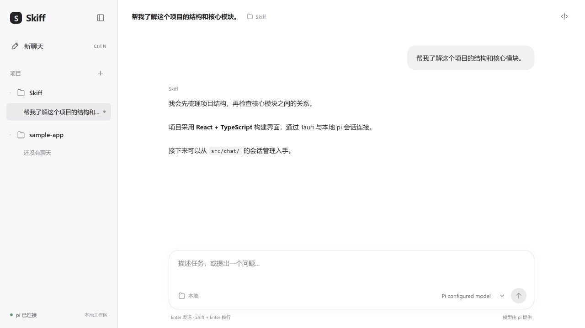
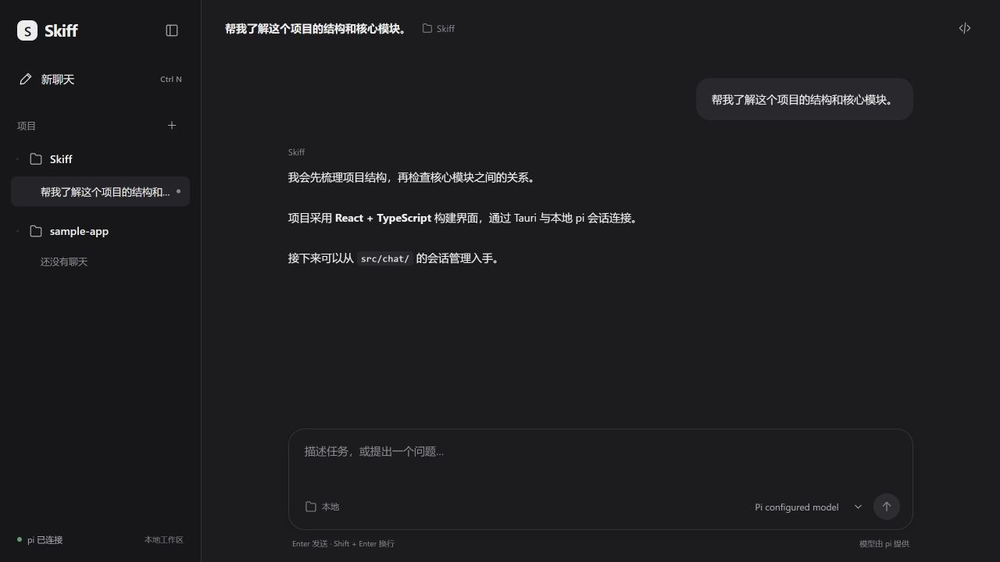

# 002 · 聊天工作区重设计

## 目标与范围

参考用户提供的 Codex 截图，采用「项目导航 + 聊天工作区」双栏布局。保持 Skiff 自己的品牌与简洁样式，不引入供应商配置页、额外模型服务或装饰性功能。本期同时实现项目目录管理与可恢复的真实聊天记录。

## 页面与视觉

- 左栏宽约 260px：Skiff 品牌 → 新聊天 → 项目标题与添加入口 → 项目 → 项目下的聊天记录。选中项使用中性背景，长标题省略，路径通过提示展示。
- 右栏：顶部显示会话标题与项目名称，右侧保留可收起的诊断入口；中部消息区；底部固定的圆角输入框，模型选择放在输入框底栏。
- 空聊天显示「今天想做点什么？」、当前项目和可点击的任务建议。建议仅填入草稿，不自动调用模型。
- 使用 CSS 变量和 `prefers-color-scheme` 跟随系统浅色/深色；灰白/炭灰底色、细边框、克制阴影。助手回复无气泡，用户消息使用淡色圆角块。
- 消息与输入框共享约 800px 的内容宽度。窄窗口可折叠侧栏，恢复按钮始终可见；诊断面板在小窗口覆盖右侧。

## 项目与会话行为

- 默认项目为桌面应用启动目录（开发模式下识别并移除 `src-tauri` 层级）。添加项目通过路径表单，由 Rust 校验为存在的目录；项目路径作为 pi 子进程的 `cwd`。
- 本地索引只保存项目路径、聊天标题、更新时间和 pi 会话文件路径，不重复保存消息或密钥。采用版本化 localStorage；存储失败提示用户，损坏数据安全回退。
- 新聊天创建空草稿，首条用户消息自动生成标题；空草稿不挤占历史记录。
- 每次打开聊天创建独立标识的 pi RPC 进程，停止之前的进程；历史聊天使用官方 `switch_session`，再通过 `get_messages` 恢复上下文。重启应用恢复上次选择。
- 初始化完成前禁止发送；生成中禁用项目/聊天切换、新聊天和模型切换，保留停止按钮。失败显式展示并提供重连，避免把新消息发送到错误项目。

## 模型与协议

- 模型仅来自 pi `get_available_models`；不硬编码模型、不读取或展示 API key、不按 auth.json 再次过滤（避免遗漏环境变量或自定义提供商）。无模型时说明需先在 pi 配置。
- RPC 启动前注册事件监听；清理失败请求与超时，避免丢失事件及悬挂请求。Rust 维护动态进程标识，关闭窗口清理进程树。
- 历史消息通过协议解析层恢复，包括用户消息、助手回复、思考、工具调用与工具结果；渲染组件不持有 RPC 协议。

## 验收

1. `npm run build`、`cargo check --manifest-path src-tauri/Cargo.toml` 通过。
2. 浅色/深色、大窗口/窄窗口检查布局、滚动、输入框和焦点状态。
3. 添加有效/无效路径、项目去重、新聊天、标题更新、历史切换和刷新恢复。
4. 使用模拟 RPC 验证流式文本、工具结果、会话恢复、取消/失败，以及只展示 pi 返回模型；本机有 pi 时再做桌面实际对话验证。
5. 中文输入法 Enter 不误发送；Enter 发送、Shift+Enter 换行；阅读历史时流式更新不强制滚到底部。

协议参考：[pi RPC](https://github.com/badlogic/pi-mono/blob/main/packages/coding-agent/docs/rpc.md)、[RPC Commands](https://github.com/badlogic/pi-mono/blob/main/packages/coding-agent/docs/rpc-commands.md)。

## 实施与验证记录（2026-10-02）

- 已实现 Sidebar、项目路径表单、工作区索引、真实 pi 会话恢复、输入区模型选择和系统主题；未新增运行时依赖。
- `npm run build`、`cargo check` 通过；`npm test` 的 5 个协议/消息测试及 Rust 的 2 个目录校验测试通过。
- 独立测试预览验证了明暗主题、600px 窄窗口、侧栏折叠、建议填入、Enter 发送、生成中导航限制、模型切换、无效/有效项目路径、新聊天、历史恢复、刷新与空草稿恢复。浏览器控制台无错误。
- 修复验证中发现的 Vite 监听 Rust 编译输出导致 Windows `EBUSY` 崩溃：忽略 `src-tauri` 目录。
- 本次未调用真实模型；当前执行环境未在 PATH 中找到 pi CLI。实际 pi 配置兼容性、真实生成与桌面退出后的进程树回收需在本机桌面运行时验证。
- 本期历史列表只索引 Skiff 创建的聊天；导入已有 pi 会话、聊天删除/重命名、系统文件夹选择器留待后续。

以下截图来自测试专用模拟 pi 桥，仅用于检查真实 UI 的布局：

