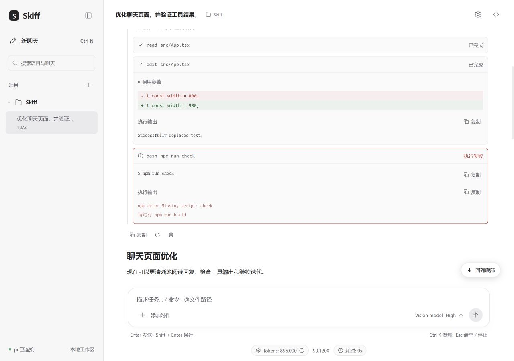
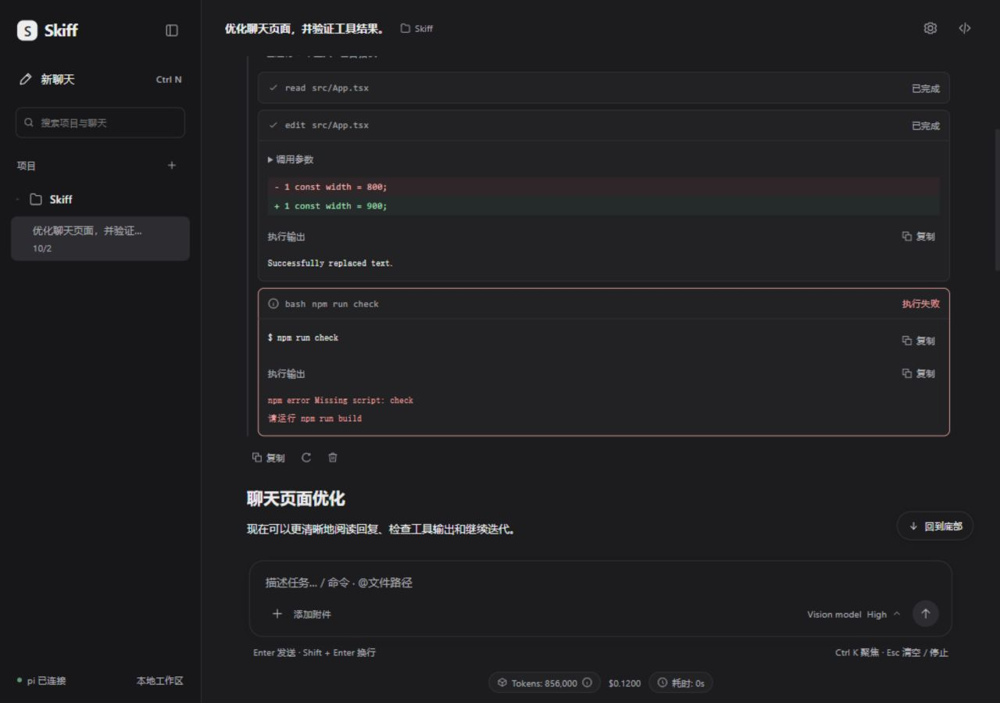
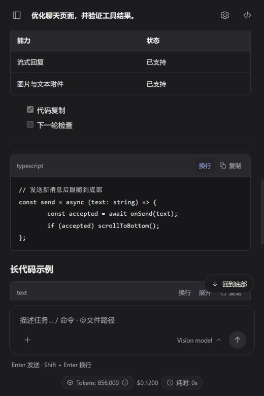

# 004 · 聊天界面打磨建议

## 背景

002 完成了「项目导航 + 聊天工作区」布局，003 补齐了模型、推理等级、用量明细、提供商与图片能力。本文保留原始界面走查建议；004 已于 2026-10-02 实施，具体范围、交互语义与验证见末尾记录。

## 范围与原则

- **仅 Windows 桌面**（Tauri 2 + WebView2）。不考虑其它操作系统的差异，快捷键沿用 Windows 的 `Ctrl` 系，无需做平台判断。
- 不改动 pi RPC 协议与后端行为，聚焦 `src/` 前端渲染与交互；如确需协议字段（如上下文窗口），优先使用已有数据。
- 沿用现有 CSS 变量与 `prefers-color-scheme` 主题，保持克制风格；除 Markdown 解析外尽量不引入重量级依赖。

## 一、实用性

### P0-1 Markdown 渲染能力（`src/components/Markdown.tsx`）

现状只支持围栏代码、行内代码、`**加粗**`、链接四种；标题、列表、引用、表格、分隔线、嵌套全部退化成普通文本，且整段 prose 被合并进一个 `
` 并 `white-space: pre-wrap`。AI 回复里最常见的列表/表格会变成一大坨文字墙，可读性差。

建议：改用 `react-markdown` + `remark-gfm`，或至少补齐 heading / ul / ol / blockquote / table / hr 与段落拆分。渲染时仍需保持流式增量更新的稳定性。

### P0-2 代码块复制与语言标签（`src/components/Markdown.tsx`、`index.css` `.code-block`）

代码块没有语言标签，也没有复制按钮 —— 这是聊天界面最高频的操作之一。建议：

- 代码块顶部加 header：语言名 + 复制按钮（复制成功给出短暂反馈）；
- 长代码支持折叠/展开、以及横向滚动与自动换行切换；
- 可选：语法高亮（shiki 或 highlight.js），至少区分关键字与注释。

### P1-3 消息级操作（`src/components/MessageItem.tsx`）

缺少**复制 / 重新生成 / 编辑并重发 / 删除**。前两项基本是聊天产品标配，coding 场景也经常需要「改一下上一句再发」。建议在消息 hover 时显示操作条，并让「编辑」把内容回填到输入框。

### P1-4 工具调用卡片（`src/components/ToolCallBlock.tsx`）

现状只显示工具名与状态，`toolResult` 又是另一条默认折叠的块，两者没有配对。对 coding agent 而言工具结果才是核心内容。建议：

- 把 `tool` 与对应 `toolResult` 合并成一张卡片；`block.id` 已可用于配对；
- `edit` / `write` 渲染 diff（红绿行）；
- `bash` 显示命令与输出尾部，错误高亮；
- 连续多个工具调用折叠成一组（「已运行 3 个工具」），避免刷屏。

### P1-5 滚动与回到底部（`src/components/MessageList.tsx`）

`scrollIntoView` 在每个流式 token 上触发且没有平滑；用户上翻后没有任何「回到底部」入口；发送新消息时也没有强制回底。建议：改用 `scrollTo({ behavior: "smooth" })`；增加右下角悬浮的「回到底部 / 有新消息」按钮；用户发送消息时强制跟随。

### P1-6 输入区交互（`src/components/Composer.tsx`）

- 缺少 `@` 文件引用与 `/` 命令面板 —— 对在项目目录里运行的 agent 很实用；
- 缺少聚焦快捷键（如 `Ctrl+K`）与 `Esc` 清空/取消；
- 附件只支持图片，coding 场景常需要粘贴日志或附加文本文件；
- `+` 旁的「本地」文案含义不明，建议改为「添加图片」或用 tooltip 说明；
- 输入框 `min-height: 68px` 偏大，空态时只占一行更紧凑。

### P2-7 侧栏会话管理（`src/components/Sidebar.tsx`、`src/App.tsx`）

聊天与项目无法重命名、删除、搜索；历史没有时间戳；侧栏展开状态是 `useState(true)`，每次启动都重置。建议补充 hover 操作菜单、会话/项目删除与重命名、按标题搜索，并把侧栏状态持久化到 localStorage。

### P2-8 上下文窗口占用

`ModelInfo.contextWindow` 已经由 pi 提供（`src/chat/types.ts`），但界面只显示绝对累计 token。产品卖点是 "Every token visible"，却缺「已用 / 上限」的占比。建议在输入框附近或用量浮层中增加上下文进度，接近上限时给出提示。

### P2-9 单条用量与汇总去重（`src/components/MessageItem.tsx`、`src/components/UsageDetails.tsx`）

每条助手消息下都有 `1,234 tokens · $0.01`，底部又有一个汇总工具条，信息重复且噪音大。建议单条用量默认只在 hover 或展开时显示，把成本/耗时集中在底部汇总。

## 二、美观性

### 视觉一致性

- **圆角不统一**：6/7/8/9/10/11/12/14/16/18/20/21 全都在用，建议收敛成 3–4 档并 token 化。
- **图标不一致**：`UsageDetails` 里用字符 `◉`、`ⓘ`，其它地方都是 SVG `Icon`，统一为同一套图标。
- **字号偏小**：10px、11px 的元信息过多，建议最小值提到 11–12px。
- **对比度**：浅色下 `--muted #86868d` 对 `#fff` 约 3.6:1，低于 WCAG AA 的 4.5:1，建议调深；深色下也偏灰。
- **选中态**：`::selection` 使用 `--selected`，与背景几乎同色，选中文字几乎看不出来。

### 布局与层级

- **角色标签冗余**：助手每条重复「Skiff」，用户侧又隐藏标签（`.msg.user .msg-role { display: none }`），两侧不对称。建议仅在角色切换时显示，或用分隔线/缩进区分。
- **正文宽度**：`--content-width: 800px` 对代码偏窄，长行只能横向滚动。建议提到 860–920，或让代码块/表格突破正文宽度。
- **代码块配色**：`.code-block` 使用 `--panel-2`，浅色下 `#fafafa` 对 `#fff` 几乎无边界，建议加语言 header 与更明显的底色。
- **空状态**（`MessageList.tsx`）：建议卡副文案只有 10px，且点击只填草稿不发送，可考虑点击即发或给出更明确的提示。

### 控件

- **模型选择器**：原生 `<select>`（`ModelPicker.tsx`）在模型较多时无法搜索，深色样式也受限。建议改为可搜索的 listbox，并顺带展示上下文窗口/成本。
- **图片**：消息里的图片不能点击放大，建议加 lightbox；`MessageItem.tsx` 的附件缩略图偏小、文件名 9px 偏小。

## 三、性能与清理

- **流式重渲染**：reducer 每个 token 产生新 state，`MessageItem` 未做 `memo`，`Markdown` 会重新解析全文，长会话会卡。建议 `React.memo(MessageItem)` 并稳定 props，只让正在流式的那条重渲染。
- **死代码**：`src/components/StatusBar.tsx` 与 `src/components/TerminalView.tsx` 没有任何引用，也没有对应 CSS，可以直接删除。

## 优先级建议

| 优先级 | 项目 | 理由 |
| --- | --- | --- |
| P0 | Markdown 渲染、代码块复制/语言标签 | 日常阅读与复制的高频路径，投入产出比最高 |
| P1 | 滚动回到底部、消息操作、工具卡片、输入区交互 | 直接决定 coding 场景好不好用 |
| P2 | 侧栏会话管理、上下文占用、用量去重 | 提升管理效率与信息密度 |
| P2 | 视觉一致性、暗色对比度、响应式细节 | 打磨观感，风险低可并行 |
| P3 | 性能 memo、删除死代码 | 长期会话流畅度与代码卫生 |

## 验收标准（拟）

1. `npm run build`、`npm test`、`cargo check --manifest-path src-tauri/Cargo.toml` 通过，不新增未使用代码。
2. 使用 `tests/preview.html` 的模拟桥，在浅色/深色、大窗口/窄窗口检查：列表与表格渲染、代码复制反馈、消息操作、工具卡片 diff 与错误、滚动回底、附件与模型菜单。
3. 长会话（数百条消息）流式输出时，滚动与输入不卡顿。
4. 键盘可达：新增按钮均有 `aria-label`，焦点顺序合理；流式区域对读屏可感知。

## 实施与验证记录

### 已实施（2026-10-02）

- 使用 `react-markdown` + `remark-gfm` + `remark-breaks`，支持标题、段落、嵌套列表、任务列表、引用、表格与分隔线，并保留段落内的单个换行；不启用原始 HTML。代码块增加语言、复制反馈、20 行以上折叠及换行切换，保留横向滚动。正文图片与用户附件共用 `ImagePreview`，支持懒加载与模态放大。
- 消息支持复制、编辑回填（保留图片）、重新生成及删除本轮；操作与单条用量仅在 hover / 键盘焦点时显示。通过 pi 现有 `get_entries` 和当前 `leafId` 定位提问，再调用 `fork`，避免纯图片、重复提问、压缩及非当前分支历史造成错位。
- 工具结果保留 `toolCallId` 与 `details.diff`，实时与恢复历史均按 ID 配对；同一消息中的连续工具折叠为一组。edit 显示原始 diff 或参数差异；write 在缺少 diff 时显示绿色写入内容（不声称已知旧文件内容）；bash 显示命令、输出末尾、完整输出切换及错误状态。
- 流式跟随合并到动画帧，用户上翻暂停跟随并显示新内容入口，发送后回底；主动回底使用平滑滚动，遵循减少动态效果设置。
- 输入区缩为单行起步，增加 Ctrl+K、Esc、真实 pi 命令搜索与键盘选择。`@` 支持手动输入项目相对路径，Enter 转为代码引用；`+`、拖放和粘贴支持图片及 UTF-8 文本文件。文本文件最多 4 个、每个 512 KiB，作为带文件名的正文发送，拒绝二进制与无效 UTF-8。
- 侧栏支持项目 / 聊天搜索、重命名与移除，日期显示，展开状态持久化。自定义聊天标题不会被自动标题覆盖；删除当前聊天自动选择同项目的历史或新草稿，至少保留一个项目。
- 模型菜单改为可搜索列表，可显示上下文、图片能力与已有模型单价。上下文占用采用最近一次请求的输入（含缓存）+ 输出估算，85% 起提示，明确标注不包含之后新增的工具结果；累计成本与耗时留在底部汇总。
- 收敛为四档圆角，提高元信息字号与主题对比度，独立选区颜色，正文宽度 900px；图片支持模态放大。memo 消息与 Markdown，保持操作回调稳定，移除未引用的 StatusBar / TerminalView。

### 用量展示调整（后续迭代）

- 移除输入框下方的常驻用量条；改为在每条助手回复末尾固定显示**本轮**用量，流式生成期间隐藏，避免中间过程跳动。
- 本轮用量条包含：本轮 Tokens（可展开明细浮层，含输入/缓存/输出/推理拆分）、预估费用、上下文窗口占用（进度条 + 百分比，85% 起警示）与本轮耗时。单条用量不再依赖鼠标悬浮，hover 仅控制复制/重新生成/删除按钮。
- 每轮耗时由 reducer 新增 `turn_duration` 事件在 `agent_end` / `agent_settled` 时挂到当前回合的助手消息；历史恢复没有摘要时长时，最后一条回退到索引保存的累计耗时。`message_end` 会保留已挂上的时长，避免事件顺序导致丢失。
- 上下文估算按本轮输入（含缓存）+ 输出与当前模型 `contextWindow` 计算，仅当该消息的 provider/model 与当前模型一致时显示。
- 删除不再使用的 `UsageDetails` 组件；构建与 19 项单测（新增 `turn_duration` 用例）通过。

### 用量展示细化（后续迭代 2）

- 用量条仅在**整个会话最后一条**助手回复显示（`isLast`），流式期间隐藏；不再逐轮展示，也不做历史耗时回退（历史只显示 Tokens 与费用）。
- 预估费用改为与耗时一致的圆角胶囊。
- **上下文占用移到输入框下方常驻显示**：迷你进度条 + 百分比 + `已用 / 上限`，85% 起警示，取最近一条已完成的助手消息与当前模型 `contextWindow` 计算。
- 排查“对话中途停下、需要手动发继续”：解析 pi 的 `stopReason`（集成测试已确认该字段存在）。最后一条助手回复的用量行新增**继续**按钮，`stopReason === "length"` 时显示为「输出被截断 · 继续」，一键发送「继续」。
- 常见原因：Skiff 为自定义 OpenAI 兼容提供商写入的 `maxTokens` 默认 8192，会限制单次回复长度；以及上下文接近上限。上下文条现在可直接看到后者。
- 新增 `stopReason` 解析单测；构建与 20 项单测通过。

### 上下文明细与模型输出上限（后续迭代 3）

- 输入框下的上下文条改为可点击，弹出明细：分段进度条 + 「系统提示词与工具定义」「对话消息」估算值 + 当前模型。由于 pi 不提供精确拆分，系统/工具部分按**首次请求输入减去首条消息估算**得出，其余计入对话消息，弹层内明确标注为估算。
- 模型菜单（输入框的模型按钮）新增「最大输出」数字输入，写入 pi `models.json` 对应模型的 `maxTokens`，并重启会话使其生效。新增 Rust 命令 `set_model_max_tokens`：保留其它字段、校验 `maxTokens ≤ contextWindow`，附单元测试。`ModelInfo` 增加 `maxTokens` 解析以回填当前值。输入框右侧实时显示 `K` / `M` 换算（如 `384000 → 384K`）并隐藏原生微调箭头，避免遮挡数字。
- **`maxTokens` 为可选**：留空表示不写该字段并删除已有覆盖，交回模型/适配器默认值（与 dsh/pi 的「最大输出 token 数」留空一致）；提供商设置里也去掉了 8192 默认值与必填校验。这样不会因为 Skiff 硬写一个较小的上限而导致回复被提前截断。
- 前端构建、`npm test`（20 项）与 `cargo test --lib`（7 项）通过。

### 交互边界

- 编辑与重新生成会替换选中提问及后续消息，保留原 pi 会话文件；删除按钮明确为「删除本轮及后续消息」，经页面确认后执行。不提供与 pi 上下文不一致的任意单条删除。侧栏删除仅移除本地索引，保留项目目录及会话文件。
- 文件路径引用由用户输入，未引入后端目录扫描或自动文件索引；文本附件会计入模型输入。语法高亮使用 highlight.js 的精选语言集，仅在消息结束（非流式）时对代码块着色，未知语言回退纯文本。

### 复核发现的遗漏（2026-10-02 复核）

按最新实现逐项对照原始建议后，以下问题的处理状态如下。

- ~~**单换行会被折叠**~~（已修复）：`react-markdown` 遵循 CommonMark 会把段落内单个换行渲染为空格，已引入 `remark-breaks` 改为 ` `；`react-dom/server` 验证 `line one\nline two` 输出两个 ` ` 换行。
- ~~**Markdown 正文图片无处理**~~（已修复）：新增 `img` 组件并复用 `ImagePreview`，模型回复里的 `` 现在有懒加载、`max-width` 和模态放大；注意相对路径仍不会解析到项目文件，仅支持远程/`data:` URL。
- ~~**文本附件会整段回显**~~（已修复）：新增 `splitAttachments` 把提问正文还原为「正文 + 附件」，用户气泡用默认折叠的 `TextAttachmentBlock` 显示文件名、行数与大小；编辑 / 重新生成时 `turnDraft` 同时还原文本附件，经 `appendTextFiles` 回填或重发，不再把整份文件铺在气泡或输入框里。
- ~~**可选语法高亮仍未引入**~~（已修复）：引入 `highlight.js` core 并注册常用语言，`.hljs-*` 用主题变量着色（浅/深各一套）；仅对已结束的消息着色，避免流式期间重复分词，未注册语言回退纯文本。
- ~~**死 CSS 残留**~~（已修复）：已移除 `.md-text`、`.md-text:last-child`、`.info-icon`、`.chat-indicator`、`.tool-args`、`.model-picker option/optgroup`。
- ~~**推理等级仍为原生 `<select>`**~~（已修复）：`ModelMenu` 的推理等级改为分段按钮组（`role="radiogroup"`），选中态用强调色，与模型列表风格一致，键盘与深色模式统一。
- ~~**侧栏重命名仅在 Enter 时保存**~~（已修复）：`rename-input` 现在 Enter 与失焦都会保存，Esc 取消；新增 `startEdit` 重置跳过标记，避免取消后误吞下一次失焦。
- ~~**消息操作条常驻占位**~~（已修复）：`.message-actions` 改为在消息下方 margin 区绝对定位，不再为每条消息预留 38px；隐藏时 `pointer-events: none` 避免误点，hover / `:focus-within` / 无 hover 设备时恢复可交互。

### 工具行与推理隐藏（后续迭代 4）

对照 Codex 的工具展示方式，把工具调用与推理从「一格格卡片」收敛为紧凑行。

- 新增 `src/chat/toolRuns.ts`：按工具名归类为 `read` / `write` / `command` / `search` / `other`，可读 / 可写 / 可执行 / 可搜索各有独立图标与短语。连续工具调用合并成一行短语（如「读取了文件运行了命令编辑了文件」），图标取权重最高的一类（`write > read > search > command > other`），因此既读过也改过时显示笔形图标，只有读与命令时显示文件图标。
- 单个工具调用保留可展开卡片，但摘要行改为「类别图标 + 短语 + 命令 / 路径」，原始工具名放进 `title`，状态仍以文字显示。多个调用折叠成一行后可展开回原来的逐张卡片（diff、输出、错误保持原样）。
- 工具行去掉边框与卡片底色，改为 Codex 式无边框行；展开的详情以左侧竖线缩进，鼠标悬浮时高亮。移除不再使用的 `.tool-group` 样式。
- 新增 `src/chat/thinking.ts`：推理折叠为一行「思考过程 + 字数」，每轮结束后隐藏不足 100 字且单行的填充式推理（如「先检查现有交互」）；流式进行中仍会显示，多行或较长的推理继续保留为可展开行。
- 每一轮在首个助手消息顶部加入一个折叠按钮（下箭头 + 「耗时X N步」），点击收起**该轮**的推理与工具调用，只保留回复正文，再次点击展开；收起/展开只靠箭头方向区分，文案不变。按钮在该轮存在推理或工具时出现，横向分隔线与正文分开。
- 每轮耗时优先用实时挂上的 `durationMs`，历史恢复时回退为用户提问与最后一条回复的 `timestamp` 差值。`ChatMessage` 新增 `timestamp`（pi 消息时间；settle 的助手消息为完成时间），reducer 在 `turn_duration` 用 `Date.now()` 覆盖。
- 会话底部原来的「耗时: X」改为 pi 完成时间的系统时间，格式为「星期XHH:MM」（如 `星期五23:15`），只保留星期几与时钟；`formatCompletedAt` 位于 `src/chat/usage.ts`。
- 同一轮内相邻的助手消息加 `compact` 类，底部间距从 28px 收到 6px，让思考 / 工具行读起来像一整块；用户提问到首条回复、以及一轮结束到下一条提问仍保留 28px。
- 复制 / 重新生成 / 删除只在整个会话**最新一条消息**上出现：中间的助手消息（无论是否带文本）都不再渲染操作条，纯推理 / 工具调用更不会留空位；用户提问保留复制 / 编辑 / 删除以便改写提问，每条消息内部的工具输出复制保持不变。整个 `.message-actions` 在既无操作也不需显示用量时完全不渲染。
- pi 一次运行会连续产生多条助手消息（各自带推理与工具调用），因此按「用户消息到下一条用户消息之间」把连续助手消息归为一轮（`groupTurns`），步数为整轮推理 + 工具调用合计，共享同一个折叠按钮，避免出现多个「1 段」多头。折叠时只留下有正文的消息，纯过程消息不再渲染，不会留下空白间隔。折叠状态按轮保存在 `MessageList` 的局部 state，不写入存储。
- 图标新增 `file` / `terminal` / `wrench`，并用 `src/components/toolIcons.ts` 集中类别到图标的映射。

### 系统提示词与逐步旁白（后续迭代 5）

Codex 之所以是「文字 + 工具 + 文字 + 工具」，是因为它的模型会在每次动作前输出一段可见 commentary 文本，而思维链走单独的隐藏通道；DeepSeek 这类推理模型把内容全放在 `reasoning_content`，几乎没有可见文本，所以 Skiff 里看到的是「思考 + 工具」。

- Skiff 现在会在启动 pi 时追加一段系统提示词，要求模型调用工具前先说一句简短旁白，从而得到 Codex 式的「文字 + 工具」。实现方式是 pi 的 `--append-system-prompt`：`RpcStartOptions` 新增 `appendSystemPrompt`，Rust 在 `rpc_start` 里把它作为启动参数传给 pi（本地校验过 `pi --mode rpc --append-system-prompt` 可用）。
- 该提示词可被用户编辑：新增 `src/chat/prompt.ts` 保存默认旁白指令（`DEFAULT_APPEND_PROMPT`）与用户在 `localStorage` 的编辑（`skiff.prompt.append`）；默认值会在顶栏的「系统提示词」弹窗（`PromptDialog`）里预填。保存后调用 `session.reconnect()` 重启会话使其生效。
- 未保存过时使用默认旁白指令；保存默认文本会清除覆盖，回到内置默认。
- 弹窗内新增只读的「查看 pi 当前系统提示词」：Rust 新增 `read_system_prompt`，从会话 `.jsonl` 最后一条 `role: "system"` 的 `sections` 读取并按 `preamble / tools / rules / docs / project_context / skills / cwd / addendum` 排序展示，每条可展开。pid 不自带 `get/set system prompt` RPC，所以走会话文件快照。

### 底部用量条的闪动修正

底部「Tokens / 费用 / 完成时间」原来按**单条消息**的 `streaming` 判断：一轮内模型调完工具、当前助手消息结束时它会出现，下一步开始流式时又隐藏，模型快时就会一闪一闪。改为按**整个运行**判断：`usePiSession` 的 `state.isStreaming`（`agent_start` 到 `agent_end`/`agent_settled` 之间保持 true）经 `ChatView → MessageList → MessageItem` 以 `running` 传入，只有 `!running` 时才展示用量条与「继续」按钮，工具执行期间保持隐藏。

### 验证

- `npm run build`、`npm test`（25 项）、`cargo check --manifest-path src-tauri/Cargo.toml` 与 `cargo test --manifest-path src-tauri/Cargo.toml --lib`（7 项）通过。
- `node tests/pi.integration.mjs <pi-cli.js>` 通过：仅本地回环服务与临时配置，验证纯图片提问处分支、命令发现及原会话恢复，同时保留推理 / 图片 / 用量验证。
- 模拟桥增加连续 text_delta 与 `get_entries` / `fork` / `get_commands`，模型带 `maxTokens` 并处理 `set_model_max_tokens`。`tests/polish.test.ts` 覆盖乱序工具 ID 与 diff、已完成消息对象稳定、文本文件边界与附件还原、语法高亮转义、`stopReason`、`turn_duration`、重复 / 纯图片提问及压缩 / 非当前分支定位，以及新增的工具归类 / 行摘要 / 推理可见性规则；`session.test.ts` 覆盖 `maxTokens` 解析；Rust 单测覆盖 `set_model_max_tokens` 只改目标字段、校验上下文窗口及留空删除覆盖。
- 浏览器预览检查 1280×900 浅色 / 深色、520×780 窄窗口，确认 Markdown、代码复制反馈 / 换行、工具 diff / 错误、模型键盘搜索、编辑图片回填与重发、图片放大 / Esc、命令 / 路径引用、上下文提示及文本附件独立发送。重新生成保留图片；页面内删除确认支持取消（保留历史）与确认（回到空态），默认聚焦取消。
- 300 条历史消息下持续流式输出时可以输入并保留下一条草稿；上翻后停留历史位置并显示新内容按钮，主动回底与发送跟随可用。聊天重命名、历史及侧栏开关在重新载入后保留。此为交互检查，未做专门帧率基准或完整读屏测试。

预览：单独运行 `npm run dev -- --port 1421 --strictPort`，打开 `/tests/preview.html?fixture=polish&theme=light`（或 `theme=dark`）；`fixture=long` 生成 300 条历史。fixture 会重置该预览站点的模拟历史，请仅用于测试端口；不带 fixture 参数可检查改名与历史持久化。

截图：

